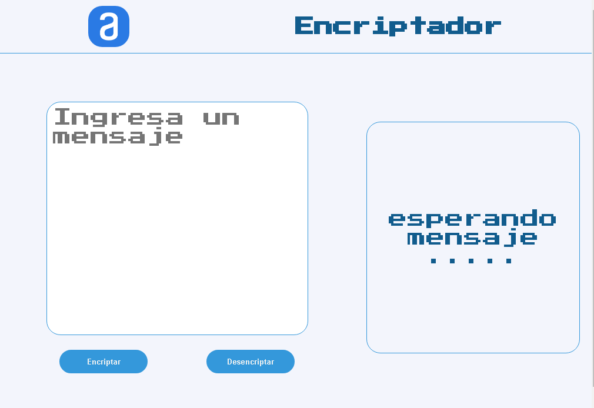

# Challenge ONE | Lógica de Programación | Encriptador de texto

     

## Bienvenido al Proyecto de Encriptador de Texto del Challenge ONE: Principiante en programación

# Descripción
---
Encriptador de texto desarrollado con JavaScript, HTML y CSS para el challenge del Proyecto ONE de Oracle+Alura LATAM.

El desafio consiste en construir una pagina web que encripte y desencripte texto que sera ingresado por el usuario y presentarlo en su forma encriptada o desencriptada.

# Modelo de Encriptación
--- 
# Requerimientos de encriptación
---
# Despliegue
---
Para el despliegue de la pagina utilice github pages como se pedia en el challenge aqui esta el link:
- Encriptador : https://cralpcode.github.io/Encriptador-de-Mensajes/
